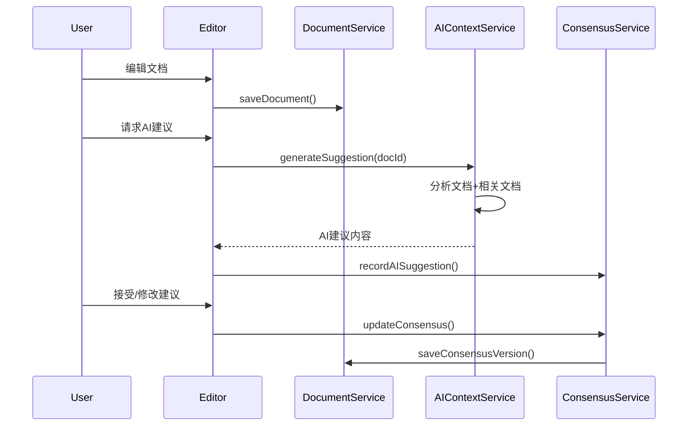
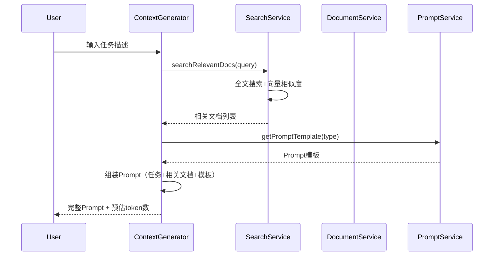

# 技术架构设计

## 技术选型

### 前端框架
- **React 18**：生态成熟，组件化开发
- **TypeScript**：类型安全，提升可维护性
- **Vite**：快速构建，开发体验好

### 状态管理
- **Zustand**：轻量级，比Redux简单易上手
  - 优点：无需 boilerplate，对新手友好
  - 场景：文档状态、用户偏好设置

### UI组件库
- **shadcn/ui**：
  - 手动复制组件代码，不引入额外依赖
  - 基于 Tailwind CSS，样式可自定义
  - 对用户零依赖成本

### 文档解析与编辑
- **Markdoc**：
  - 结构化Markdown解析
  - 比MDX更轻量，适合文档系统
  - 支持自定义节点和标签

### 路由
- **React Router v6**：声明式路由，支持嵌套路由

---

## 架构分层

### 1. 表示层（Presentation Layer）
**组件职责**：UI展示、用户交互

**主要组件**：
```
src/components/
├── layout/          # 布局组件（Header, Sidebar, Main）
├── editor/          # 文档编辑器（MarkdownEditor, Preview）
├── ai-suggestions/  # AI建议展示（SuggestionPanel, DiffViewer）
└── task-board/      # 任务看板（TaskCard, TaskList）
```

### 2. 业务逻辑层（Business Logic Layer）
**服务职责**：核心业务逻辑实现

```
src/services/
├── DocumentService     # 文档CRUD、索引
├── AIContextService    # AI上下文生成
├── ConsensusService    # 共识追踪
├── SearchService       # 全文搜索
└── PromptService       # Prompt模板管理
```

### 3. 数据访问层（Data Access Layer）
**存储方案**：浏览器本地存储（IndexedDB）

**原因**：
- 纯前端应用，无需后端
- 用户数据本地存储，隐私性好
- 简化部署（静态托管即可）

**实现**：
```typescript
// src/lib/storage/idb.ts
import { openDB, DBSchema } from 'idb'

interface AIHelperDB extends DBSchema {
  documents: {
    key: string
    value: Document
    indexes: { 'by-path': string }
  }
  ai_suggestions: {
    key: string
    value: AISuggestion
    indexes: { 'by-doc': string }
  }
}
```

---

## 核心流程设计

### 流程1：文档编辑与AI建议


### 流程2：上下文生成


---

## 扩展性设计

### 未来支持后端（可选）
如果未来需要多人协作或云端同步：

```typescript
// src/lib/storage/interface.ts
interface StorageInterface {
  getDocument(id: string): Promise<Document>
  saveDocument(doc: Document): Promise<void>
  searchDocuments(query: string): Promise<Document[]>
}

// 实现1：IndexedDB（当前）
class IndexedDBStorage implements StorageInterface { /* ... */ }

// 实现2：REST API（未来）
class APIStorage implements StorageInterface { /* ... */ }
```

### 插件化AI服务
```typescript
// src/services/ai/interface.ts
interface AIService {
  generateSuggestion(document: Document): Promise<string>
  generateContext(task: string, docs: Document[]): Promise<string>
}

// Claude实现
class ClaudeService implements AIService { /* ... */ }

// 其他AI实现（未来）
class OpenAIService implements AIService { /* ... */ }
```

---

## 性能优化策略

### 1. 文档加载优化
- 虚拟滚动：长文档只渲染可视区域
- 分片加载：大文档按需加载

### 2. 搜索优化
- IndexedDB 全文索引
- Web Worker 异步搜索（避免阻塞UI）

### 3. 缓存策略
- 最近文档缓存到内存
- 文档内容 LRU 缓存

### 4. Bundle优化
- 路由懒加载（React.lazy）
- Markdoc 动态导入（使用到时才加载）
- 图标按需导入
