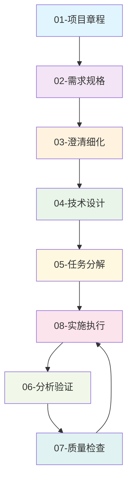

# Dodo 项目文档

## 📋 文档架构概览

本项目采用**文档驱动开发(Document-driven Development)**理念，融合**Speckit工作流模式**，建立了8层递进的文档体系。

### 🏗️ 文档目录结构

```
project-docs/
├── 📖 01-项目章程/              # 项目根本大法和价值基线
│   ├── 项目章程.md              # 项目宪法和核心原则
│   ├── 项目愿景.md              # 项目愿景和使命
│   └── 核心价值观.md            # 核心价值观和行为准则
│
├── 📝 02-需求规格/              # 用户需求和功能规格
│   ├── 功能规格.md              # 详细的功能规格说明
│   ├── 用户需求.md              # 用户需求和痛点分析
│   ├── 用户故事.md              # 具体的用户使用场景
│   └── 验收标准.md              # 功能完成的验收标准
│
├── 🔍 03-澄清细化/              # 消除歧义和明确细节
│   ├── 澄清记录.md              # 模糊点的澄清记录
│   ├── 假设约束.md              # 项目假设和约束条件
│   ├── 边界情况.md              # 边缘情况和异常处理
│   └── 答疑记录.md              # 问答和讨论记录
│
├── 🏗️ 04-技术设计/              # 技术架构和设计方案
│   ├── 实施计划.md              # 整体技术实施计划
│   ├── 架构设计.md              # 系统架构和模块设计
│   ├── 技术规格.md              # 详细技术规格说明
│   ├── 接口设计.md              # API接口设计文档
│   └── 数据设计.md              # 数据库和存储设计
│
├── 📋 05-任务分解/              # 可执行的任务清单
│   ├── 任务清单.md              # 具体可执行的任务列表
│   ├── 工作流程.md              # 标准化工作流程
│   ├── 里程碑.md                # 项目里程碑和节点
│   └── 依赖关系.md              # 任务间的依赖关系
│
├── 🔬 06-分析验证/              # 文档一致性和质量验证
│   ├── 一致性分析.md            # 文档间一致性检查
│   ├── 可追溯性.md              # 需求到实现的追溯
│   ├── 风险分析.md              # 项目风险分析和应对
│   └── 影响分析.md              # 变更影响分析报告
│
├── ✅ 07-质量检查/              # 各类质量检查清单
│   ├── 质量清单.md              # 通用质量检查清单
│   ├── 评审标准.md              # 文档评审标准
│   ├── 测试清单.md              # 功能测试检查清单
│   └── 部署清单.md              # 部署发布检查清单
│
├── 🚀 08-实施执行/              # 代码实现和部署指南
│   ├── 实施指南.md              # 开发实施指导手册
│   ├── 代码规范.md              # 编码标准和最佳实践
│   ├── 环境配置.md              # 开发环境配置指南
│   ├── 部署指南.md              # 生产环境部署指南
│   └── 命令系统.md              # Speckit命令系统说明
│
└── ℹ️ 09-元信息/                # 文档管理和参考信息
    ├── 变更日志.md              # 文档变更历史记录
    ├── 术语表.md                # 项目术语和词汇表
    ├── 参考资源.md              # 外部参考和资源链接
    └── 模板指南.md              # 文档模板和写作指南
```

## 🔄 Speckit工作流

### 核心命令体系
- **`/章程`** → 创建项目章程
- **`/规格`** → 定义功能规格
- **`/澄清`** → 澄清模糊点
- **`/设计`** → 生成技术方案
- **`/任务`** → 分解可执行任务
- **`/分析`** → 验证一致性
- **`/检查`** → 生成检查清单
- **`/实施`** → 执行代码转换

### 工作流程


## 📖 使用指南

### 新项目开始
1. 从 `01-项目章程/项目章程.md` 开始
2. 依次完成每个层次的文档
3. 使用相应的Speckit命令辅助

### 文档维护
- 所有修改都要记录在 `09-元信息/变更日志.md`
- 遵循 `09-元信息/模板指南.md` 的格式规范
- 定期进行 `06-分析验证/一致性分析.md`

### 质量保证
- 每个文档完成后使用 `07-质量检查/` 中的相应清单
- 重要节点需要进行 `06-分析验证/` 中的各项分析
- 确保 `05-任务分解/依赖关系.md` 的准确性

---

*本文档体系遵循"文档即契约"的理念，是Dodo项目的核心协作框架。*